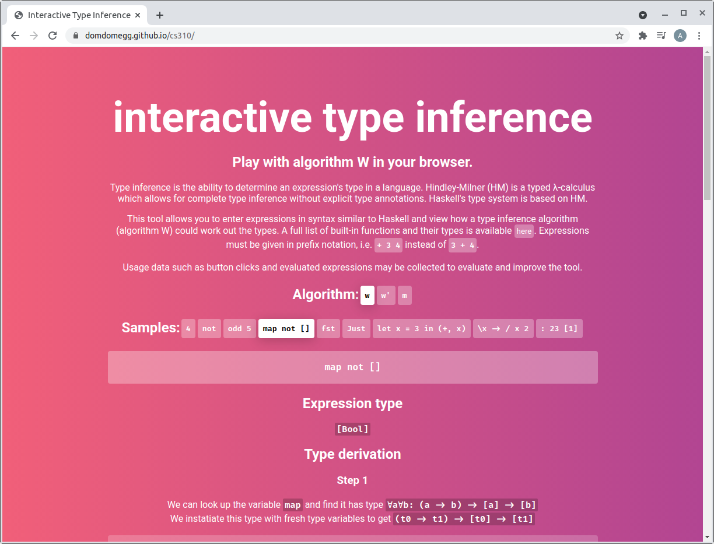
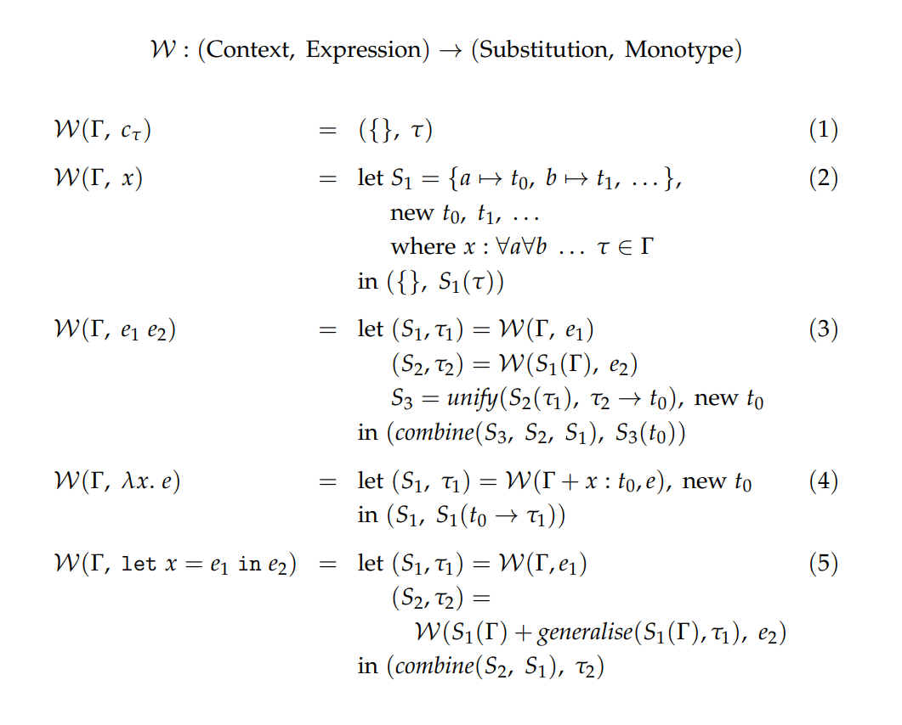
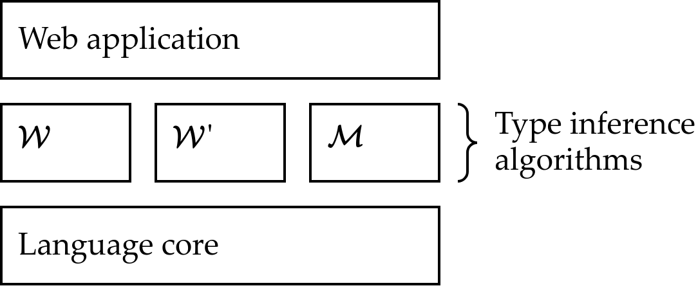
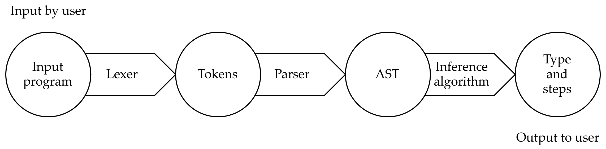

# cs310 [(try live)](https://domdomegg.github.io/cs310/)

Monorepo containing the resources for my CS310 Final Year Individual Project, OTTIE (_Online Teaching Type Inference Environment_).

## Summary

[Type inference](https://en.wikipedia.org/wiki/Type_inference) is a process by which types of a program are determined automatically by a compiler, without needing programmers to supply explicit type annotations. Understanding type inference helps programmers debug type errors and better understand type systems. However, few accessible teaching resources are available. This project presents an interactive type inference teaching tool, OTTIE, for a [Hindley-Milner](https://en.wikipedia.org/wiki/Hindley%E2%80%93Milner_type_system) based expression language. It visualises and explains the steps taken by the common type inference algorithms [W](https://doi.org/10.1016/0022-0000(78)90014-4), [W'](https://doi.org/10.1007/3-540-48515-5_9) and [M](https://doi.org/10.1145/291891.291892). User testing with undergraduate students shows that OTTIE improves their test scores in a quiz on types and type inference (p < 0.001), and general feedback from users is positive. Analytics data provides evidence that the tool’s output aids understanding and allows users to debug type errors.

## What is type inference?

Given a program or expression, we can often infer some (or all) of its types. For example, in the simple expression:

`odd(3)`

We might make the observations:
- `3` is an integer constant, so has type `Int`
- `odd` is a function defined globally (for our language - like a standard library), and we know it has type `Int -> Bool` (it returns whether the number is odd, e.g. `odd(1) == odd(3) == True`, `odd(2) == False`)
- Given we have applied a function `Int -> Bool` to an `Int`, we expect the overall result of the expression to be a `Bool`.

With the expression:

`odd(True)`

We might make the observations:
- `True` is a boolean constant, so has type `Bool`
- `odd` is has type `Int -> Bool`, as before
- Given we have applied a function `Int -> Bool` to an `Bool`, we raise a type error as these types do not match. This flags to the programmer they have made a mistake which they can fix (and fewer mistakes in programs is good!).

These are both simple examples, but we can take type inference further by adding more constructs to our language. For example we can add function abstraction (written `\param -> body`), effectively creating a new anonymous function (arrow or lambda functions in JavaScript or Java/C++/Python-speak). We also add let statements, similar to function abstraction but given a parameter directly - this allows us to perform generalisation without making the type system undecidable (as it is in System F, [as proved by Joe Wells](https://www.sciencedirect.com/science/article/pii/S0168007298000475), which peforms generalisation more). Generalisation is how we get parametric polymorphism, and is the process by which we can convert a type like `[t0] -> Int` to `forall. [t0] -> Int` (the difference between being able to apply it to one type of array, or any array. this type would be good for an array length function for example).

All together, we can now get expressions like:

`let id = (\x -> x) in (id 3, id [True, False])`

Exciting! The typing rules of our language are defined by the type system. The Hindley-Milner type system is one such example, and is the one we use. This formalises what we've discussed with lots of very clever maths. [Algorithm W](https://doi.org/10.1016/0022-0000(78)90014-4) is commonly seen as _the_ type inference algorithm for Hindley-Milner, and is a frequently studied algorithm for type inference. It's the basis for ML's type inference, and Haskell used to perform similar type inference (but later [changed](https://doi.org/10.1017/S0956796811000098) for performance and to better support extensions to the type system). Apple's Swift uses [an algorithm](https://apple-swift.readthedocs.io/en/latest/TypeChecker.html) "reminiscent of the classical Hindley-Milner type inference algorithm".

Algorithm W is presented as a series of rules for differnet expressions:

(These mathematical expressions are a little scary when presented like this, and it's not exactly friendly for newcomers to understand - that's what OTTIE aims to change!)

In addition to W, there are other algorithms that perform type inference on the Hindley-Milner type system including W' and M. All of these are available in OTTIE, which shows a step-by-step derivation for them running on any syntactically valid input expression.

## Structure

OTTIE is composed of five loosely-coupled TypeScript packages. These include a language core, which contains shared models and functions for handling a simple expression language (with similar syntax to Haskell) and its type system. On top of this 3 type inference algorithms are implemented: Algorithm W, W' and M (computer scientists do not come up with creative names!). The web application consumes all these libraries and provides an interface to users shows step-by-step type inference derivations for custom user input expressions.

- [`language`](./language): The language core contains shared models such as AST nodes for representing input expressions, contexts to represent bound variables and substitutions useful for type inference algorithms. The language core also includes a lexer and paser (using the [Masala](https://github.com/masala/masala-parser) parser combinator library) for the basic expression language, along with utility functions for manipulating its models.
- [`algorithm-w`](./algorithm-w): An implementation of Robin Milner's Algorithm W introduced in [A theory of type polymorphism in programming](https://doi.org/10.1016/0022-0000(78)90014-4).
- [`algorithm-w-prime`](./algorithm-w-prime): An implementation of Bruce McAdam's Algorithm W' introduced in [On the unification of substitutions in type inference](https://doi.org/10.1007/3-540-48515-5_9).
- [`algorithm-m`](./algorithm-m): An implementation of Oukseh Lee and Kwagkeun Yi's Algorithm M introduced in [Proofs about a folklore let-polymorphic type inference algorithm](https://doi.org/10.1145/291891.291892).
-  [`web`](./web): The web application itself. Allows users to enter an expression and view the resulting type and step-by-step type derivation. Visualises the expression's equivalent AST, highlighting relevant parts being acted upon in the step-by-step instructions. Behind the scenes, the expression is lexed and parsed by the language core, and type inference is done by one of the type inference algorithms. Created with [Create React App's TypeScript preset](https://create-react-app.dev/docs/getting-started/#creating-a-typescript-app). Sends analytics events to an [analytics lambda](https://github.com/domdomegg/analytics-lambda).

In addition to these packages, this repo contains some supporting files.

- [`docs`](./docs): Project documentation, including the specification, progress report and final report LaTeX sources and build scripts. Most of the LaTeX is automatically generated from Google Docs using my [gdoc2latex](https://github.com/domdomegg/gdoc2latex) tool.
- [`.github/workflows`](./.github/workflows): CI scripts for building the packages and documentation with GitHub Actions on each commit. Also handles publishing the static site to the `gh-pages` branch so it's kept up to date.

## Contributing

To set up your coding environment:
- open this monorepo (at the top-level) in [VS Code](https://code.visualstudio.com/)
- install [Node 14](https://nodejs.org/)
- install [NPM 7](https://www.npmjs.com/) (after Node 14, you should be able to run `npm i -g npm@7`)
- follow the setup instructions for the corresponding package